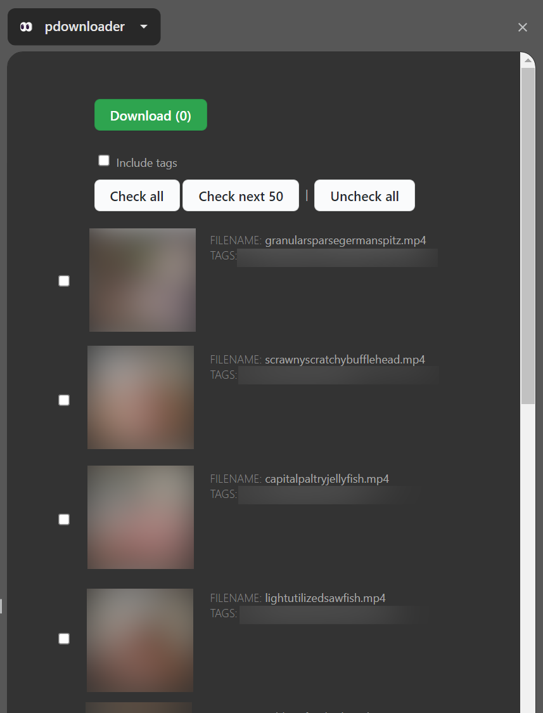

# pdownloader

A Chrome side panel extension that detects adult media on the current tab and allows batch downloading. To use the extension, [open the side panel](https://support.google.com/chrome/answer/13156494?hl=en#zippy=%2Cuse-side-panel) on a supported site (listed below).

If tags were detected, they can be included in the filename by checking the "Include tags" box.

## RedGifs

Due to RedGifs infinite scrolling, only the _loaded_ media will be detected. Scroll the page to the desired media count before opening the side panel. The extension uses a [temporary token](https://github.com/Redgifs/api/wiki/Temporary-tokens) to load media details, which includes rate limiting. If you have issues detecting a large number of media, please load a smaller number and run the extension multiple times.